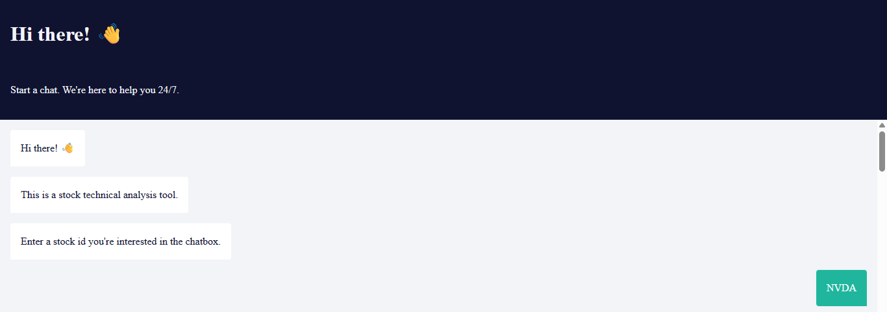
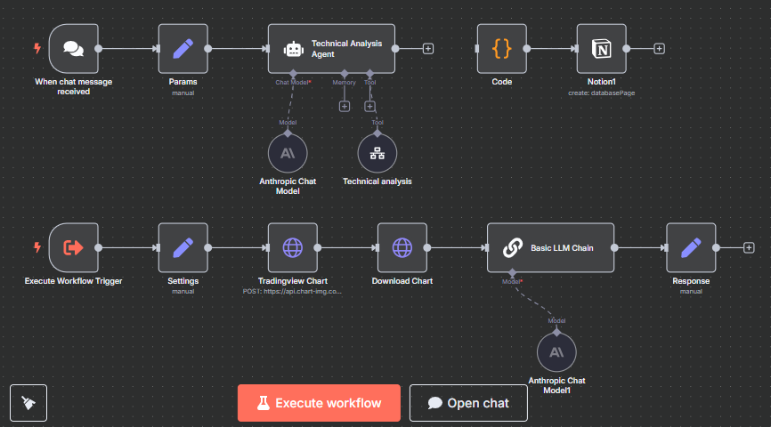

# 📈 Stock Technical Analysis Chatbot (n8n + Claude + TradingView)

A no-code/low-code chatbot built with [n8n](https://n8n.io/) that performs real-time technical analysis on stocks using data from TradingView and commentary generated by Claude (Anthropic).

## 💡 Features

- 🔍 Input a stock symbol (e.g., `NVDA`) via chat
- 📊 Automatically fetches:
  - SuperTrend (10, 3)
  - 20-day SMA
  - Volume data
- 🧠 Claude analyzes the chart and generates trade ideas
- 📘 Optionally saves the result to Notion
- 🌐 Built with n8n + TradingView + Claude

## 🚀 Demo

## 🧠 Architecture Overview

The n8n workflow is composed of the following key modules:

1. **Chat Trigger** – receives stock ticker input from the user
2. **Claude LLM Chain** – prompts Anthropic Claude to generate human-like technical analysis
3. **TradingView Chart Fetcher** – pulls SuperTrend, SMA, and Volume chart via chart-img API
4. **Basic LLM Chain** – uses Claude to analyze the chart image
5. **Response Node** – generates a readable final summary
6. **Notion Integration** – logs output (optional)

🖼️ **Workflow Preview:**

