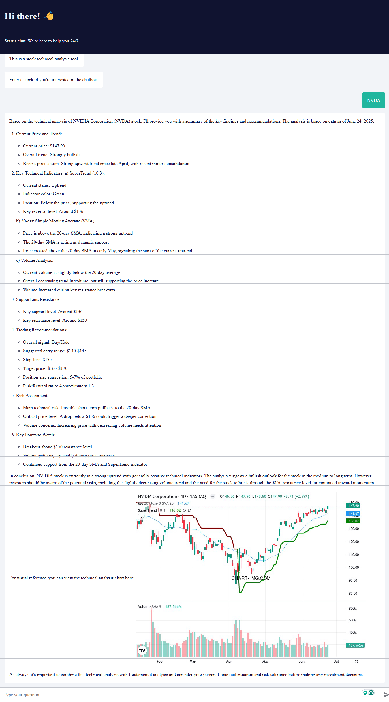

# 📈 Stock Technical Analysis Chatbot (n8n + Claude + TradingView)

A no-code/low-code chatbot built with [n8n](https://n8n.io/) that performs real-time technical analysis on stocks using data from TradingView and commentary generated by Claude (Anthropic).

## 💡 Features

- 🔍 Input a stock symbol (e.g., `NVDA`) via chat
- 📊 Automatically fetches:
  - SuperTrend (10, 3)
  - 20-day SMA
  - Volume data
- 🧠 Claude analyzes the chart and generates trade ideas
- 📘 Optionally saves the result to Notion
- 🌐 Built with n8n + TradingView + Claude

## 🚀 Demo



## 🛠 How to Use

1. Clone the repo:
   ```bash
   git clone https://github.com/your-username/stock-analysis-chatbot-n8n.git
